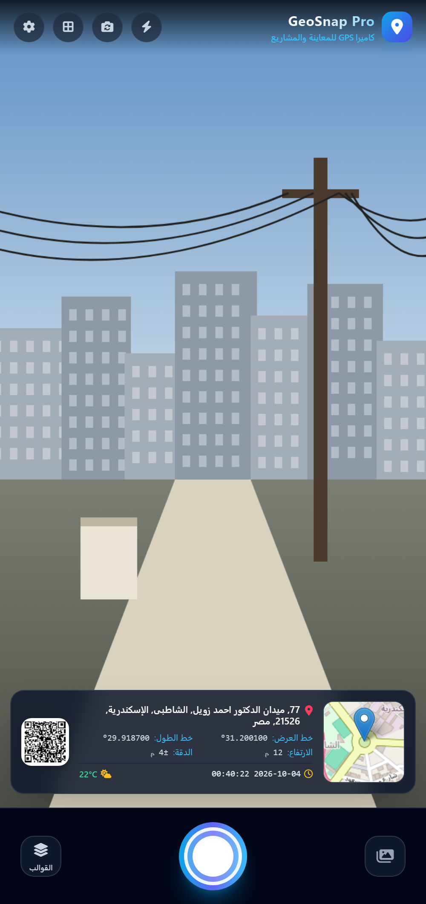
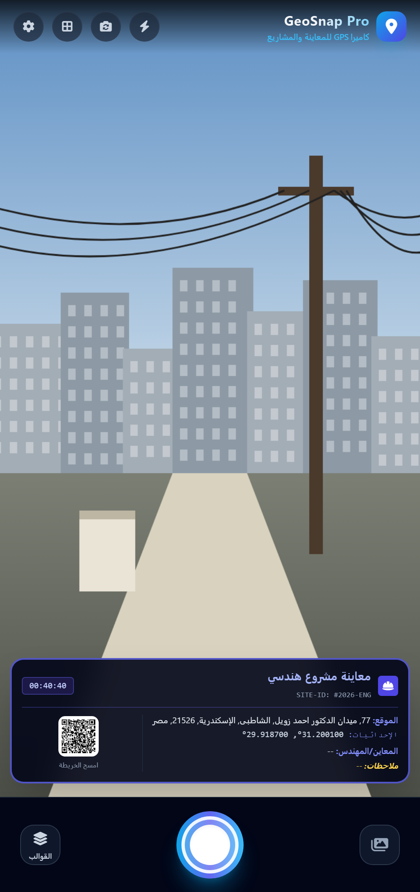
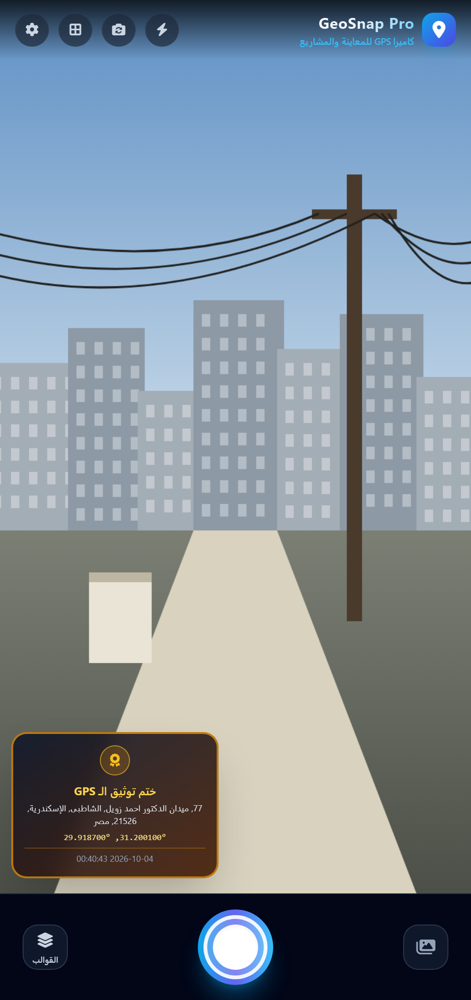

<div align="center">


# GeoSnap Pro

**GPS camera for site inspections — every photo stamped live and saved with real EXIF geotags**

كاميرا GPS للمعاينات الميدانية: كل صورة بتتختم بالموقع والوقت وبتتحفظ ببيانات GPS حقيقية


 &nbsp;
 &nbsp;


</div>

GPS camera app for field inspections and project documentation, built with Capacitor for Android. Every photo is watermarked live and saved with real EXIF GPS data — with an Arabic-first, bilingual (AR/EN) UI.

## Features

- **Live GPS watermark overlay** with 4 selectable stamp templates:
  - **Classic GPS Map Stamp** — mini map, coordinates, altitude, accuracy, address, weather, QR code
  - **Engineering / Site Inspection** — project title, site ID, inspector name, field notes, QR code
  - **Sleek Minimalist Bar** — compact coordinates + date/time strip
  - **Official Badge Seal** — logo, address, coordinates, date, in a formal seal
- **Real EXIF geotagging** — captured photos are saved to the phone gallery with genuine GPS EXIF data (via `piexif`), not just a burned-in overlay.
- **Manual location correction** — drag a pin on the map to fix GPS drift before or after capture.
- **Project/inspection metadata** — project name, inspector name, site ID, notes, and a custom company logo, applied to the watermark.
- **In-app gallery** with full-screen photo viewer, share, and delete.
- **PDF inspection reports** generated from the gallery (via `jsPDF`).
- **Bilingual UI** (Arabic RTL / English) with a language switcher, and a fatal-error recovery overlay so a failed vendor script never leaves a blank screen.
- Flash, camera flip, framing grid, and pinch-to-zoom (digital crop zoom).

## Screenshots

| Classic GPS stamp | Choosing a template | Engineering inspection | Official seal |
|---|---|---|---|
|  |  |  |  |

<sub>Captured from the app's web build with a demo GPS position in Alexandria. The camera view is a drawn placeholder scene, not a real photo.</sub>

## Tech Stack

- Capacitor (`@capacitor/core`, `@capacitor/android`, `@capacitor/app`)
- Vanilla JS + Tailwind (prebuilt, vendored) for the UI
- Leaflet for maps, `piexif` for EXIF writing, `qrcode` for QR stamps, `jsPDF` for reports
- Native Android bridge (`GeoCamNativePlugin.java`) for gallery save / native camera permissions

## Getting Started

```bash
npm install
npm run sync          # cap sync android
```

Open `android/` in Android Studio to build/run, or use Capacitor's CLI directly.

### Release build

```bash
npm run build:release   # obfuscates www/ into www-release/ and builds a signed release APK
```

See [build-release.js](build-release.js) for what this does and does not protect against — the JS is obfuscated, not made secret, since a WebView must ship code the device can execute.

## Project Structure

- `www/` — app source (HTML/CSS/JS), edited directly; untouched by the release build
- `www-release/` — generated obfuscated copy (git-ignored, not committed)
- `android/` — native Android/Capacitor project
- `build-release.js` — obfuscates `www/` and produces a signed release APK
- `preview-server.js` — local static server for previewing `www/` in a browser

## Note on signing

The release keystore (`android/keystore/`, `android/keystore.properties`) is intentionally excluded from version control — keep a secure backup of it separately, as it's required to publish updates to the same app listing.
